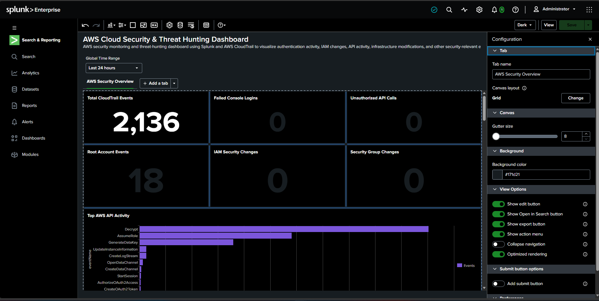
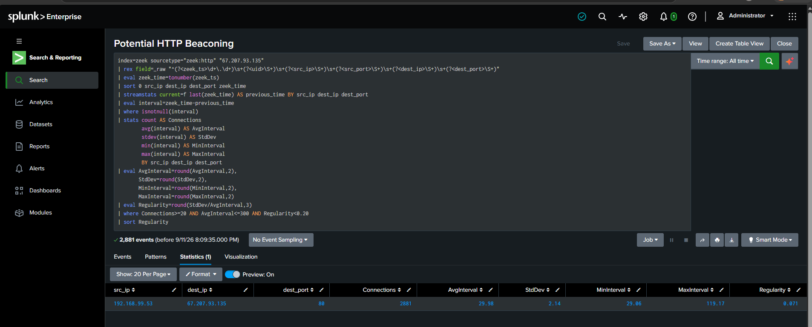
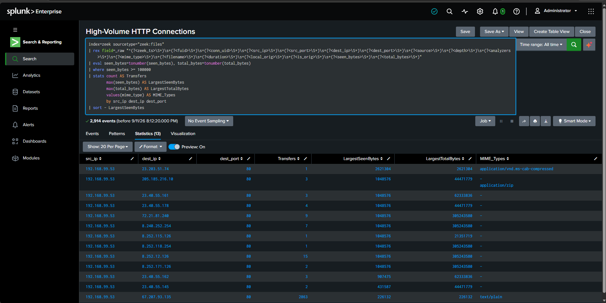
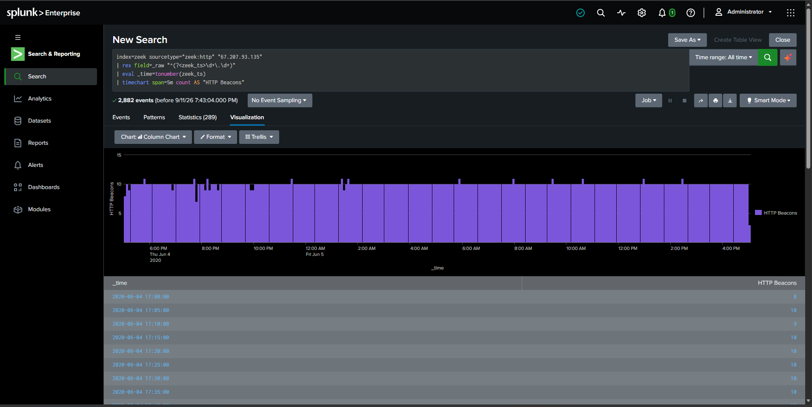
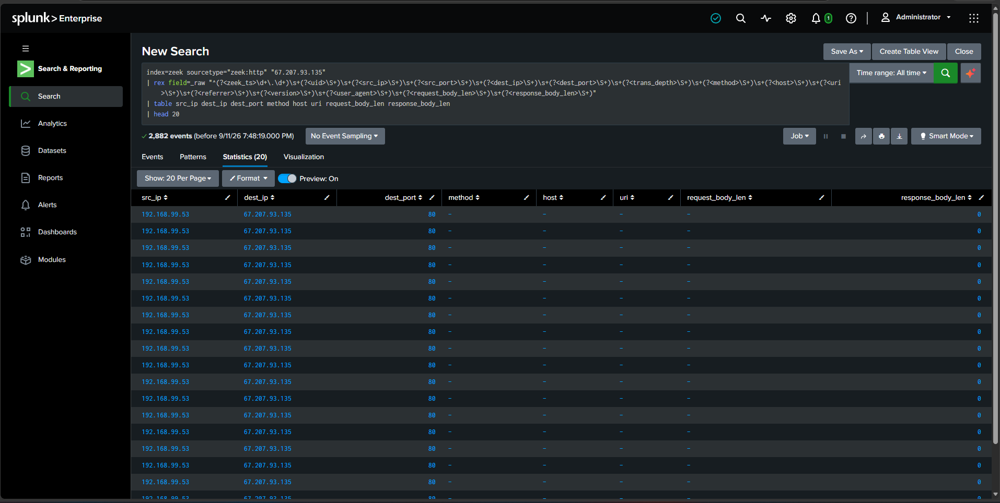
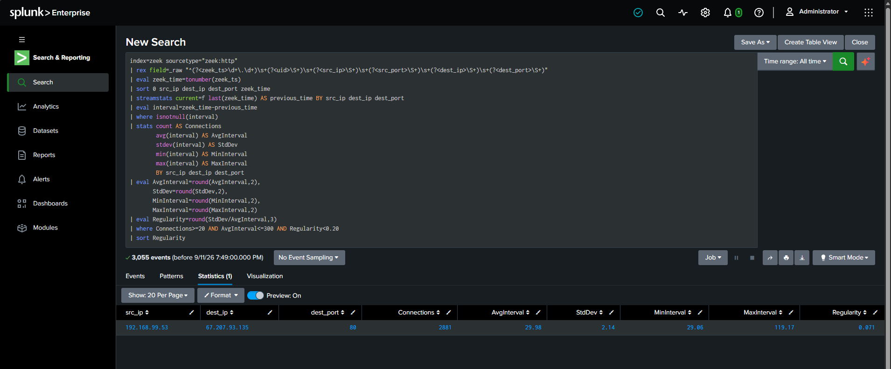
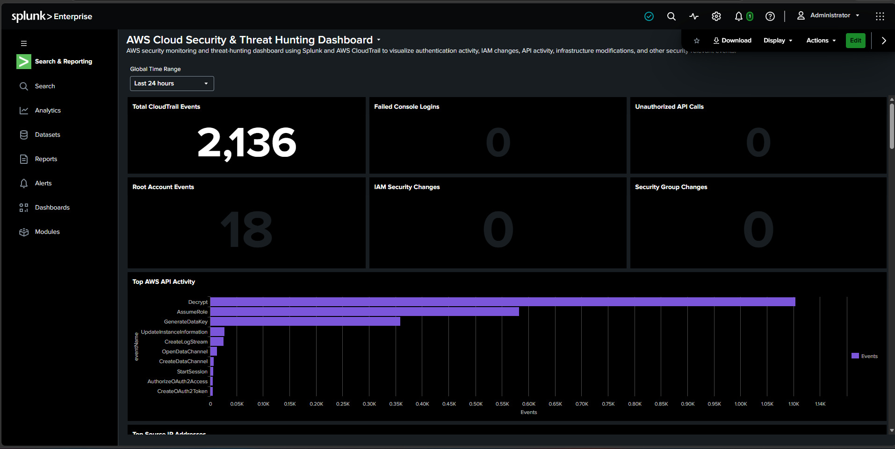

# AWS Zeek Threat Hunting & Detection Lab

## Project Overview

This project demonstrates the design and implementation of a cloud-based threat hunting and detection engineering lab in AWS. The environment was built to collect and analyze network and security telemetry using **Zeek, Splunk, AWS CloudTrail, and VPC Flow Logs**.

The primary investigation focused on identifying **suspicious HTTP activity and beaconing behavior** by analyzing network events in Splunk and developing searches and dashboard visualizations that could assist a SOC analyst during an investigation.

---

## Objectives

- Build an AWS-based environment for security monitoring and threat hunting
- Collect network telemetry using Zeek
- Centralize and analyze security events in Splunk
- Investigate HTTP traffic for suspicious behavior
- Identify repeated network communication that may indicate beaconing
- Develop SPL searches to support threat hunting
- Create visualizations and dashboards for analyst investigation
- Document findings using repeatable evidence

---

## Lab Architecture

The lab uses AWS infrastructure as the foundation for generating and collecting security telemetry.

```text
                AWS Cloud Environment
                        |
          +-------------+-------------+
          |                           |
      CloudTrail                  VPC Traffic
                                      |
                                      v
                                Network Activity
                                      |
                                      v
                                    Zeek
                                      |
                               Network Logs
                                      |
                                      v
                                   Splunk
                                      |
                    +-----------------+----------------+
                    |                                  |
               SPL Searches                     Dashboards
                    |                                  |
                    +------------ Threat Hunting ------+
```

### Security Data Sources

| Technology | Purpose |
|---|---|
| AWS | Cloud infrastructure hosting the lab |
| Zeek | Network security monitoring and protocol telemetry |
| Splunk | SIEM, log searching, investigation, and visualization |
| CloudTrail | AWS API and account activity logging |
| VPC Flow Logs | Network flow visibility |
| HTTP telemetry | Analysis of web communication patterns |

---

## Threat Hunting Workflow

The investigation followed a basic SOC threat-hunting methodology:

**Collect → Search → Identify → Investigate → Correlate → Visualize**

Network telemetry was ingested into Splunk and examined using SPL queries. HTTP communication patterns were reviewed for repeated connections, unusual activity, and behavior that could warrant further investigation.

---

## Splunk Threat Hunting Dashboard

A Splunk dashboard was developed to provide centralized visibility into the network events being investigated.



The dashboard allows an analyst to move from high-level telemetry into more focused searches when suspicious behavior is identified.

---

## Suspicious HTTP & Beaconing Investigation

One focus of the lab was identifying network communication patterns that could resemble **HTTP beaconing**.

Beaconing can occur when a compromised endpoint periodically communicates with external infrastructure. Analysts can investigate this behavior by examining repeated connections, timing patterns, source and destination systems, and HTTP activity.

### Beaconing Search

Splunk searches were used to narrow the dataset and identify potentially suspicious HTTP communication.



This demonstrates using SIEM telemetry to move from raw events toward activity requiring additional investigation.

---

## HTTP Connection Analysis

HTTP events were examined to understand communication between systems and identify patterns within the network traffic.



Relevant fields can help an analyst determine:

- Source systems initiating communication
- Destination systems receiving connections
- HTTP request activity
- Repeated communication
- Frequency and timing of network events

---

## Beaconing Timeline Analysis

Repeated communication becomes more useful when analyzed over time.



Timeline analysis helps identify periodic or recurring communication that may be consistent with automated activity.

A repeated pattern alone does **not** prove malicious command-and-control activity. Instead, it provides a lead that can be correlated with additional network, endpoint, DNS, HTTP, and cloud telemetry.

---

## Network Event Analysis

Raw network events were also reviewed in table format to support investigation and correlation.



Event-level analysis allows analysts to inspect individual records after identifying an interesting pattern through a broader search or visualization.

---

## SPL Threat Hunting

Splunk Processing Language (SPL) was used to search, filter, aggregate, and analyze the collected telemetry.



The investigation demonstrates practical experience with:

- Searching security telemetry
- Filtering network events
- Working with HTTP/network fields
- Aggregating events
- Identifying repeated communication
- Analyzing event frequency
- Creating visualizations from search results

---

## Final Threat Hunting Dashboard

The investigation results were brought together into a final dashboard for easier analyst review.



The dashboard provides a repeatable starting point for investigating suspicious network behavior instead of relying exclusively on individual ad-hoc searches.

---

## Detection Engineering Lessons

A key lesson from this project is that a detection should not simply label repeated network traffic as malicious.

Repeated HTTP communication may originate from legitimate applications, software updates, monitoring tools, APIs, or other automated services.

A stronger investigation requires correlation with additional evidence such as:

- Destination reputation
- DNS activity
- HTTP request characteristics
- Connection timing
- Cloud activity
- Endpoint telemetry
- Historical behavior

This reduces false positives and gives analysts more context before escalating an event.

---

## Skills Demonstrated

This project demonstrates hands-on experience with:

- AWS security monitoring
- Network security monitoring
- Zeek telemetry
- Splunk SIEM
- SPL queries
- Threat hunting
- Detection engineering
- HTTP traffic analysis
- Beaconing analysis
- CloudTrail
- VPC Flow Logs
- Security event investigation
- Dashboard creation
- Evidence-based security analysis

---

## Key Takeaways

This lab strengthened my understanding of how network telemetry can be transformed into actionable security information.

Rather than relying solely on automated alerts, the project demonstrates a threat-hunting approach in which an analyst develops a hypothesis, searches available telemetry, examines patterns, validates findings, and creates reusable searches and dashboards.

The project also reinforced an important detection-engineering principle:

> **Suspicious behavior is a starting point for investigation—not automatically proof of compromise.**

---

## Repository Structure

```text
aws---zeek---threat---hunting---lab/
│
├── README.md
│
└── screenshots/
    ├── 01-splunk-threat-hunting-dashboard.png
    ├── 02-suspicious-http-beaconing-search.png
    ├── 03-http-connection-analysis.png
    ├── 04-beaconing-timeline-analysis.png
    ├── 05-network-traffic-event-table.png
    ├── 06-splunk-threat-hunt-query.png
    ├── 07-final-threat-hunting-dashboard.png
    └── README.md
```

---

## Disclaimer

This project was created in a controlled lab environment for educational and cybersecurity training purposes. The techniques demonstrated are intended for defensive security monitoring, threat hunting, and detection engineering.
